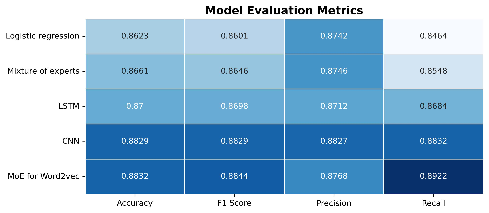

# Mixture of Experts for Sentiment Analysis on IMDb Reviews 🎭  
### **Natural Language Processing - Text Classification**

## 📌 Overview  
This project explores **sentiment analysis** using **Natural Language Processing (NLP)** on the **IMDb dataset**, which consists of movie reviews labeled as **positive (1) or negative (0)**.  
The objective is to train various models, including Mixture of Experts, that can **automatically classify** whether a given review expresses a positive or negative sentiment.  

## 🔍 **Approach**  
We implement and compare two types of **word embeddings** with different models:  

1. **TF-IDF Embedding** (Text mapped to a frequency-based vector)  
   - 📌 **Naive Mixture of Experts (MoE) Model**  
   - 📌 **Logistic Regression**  

2. **Word2Vec Embedding** (Each word mapped to a dense vector capturing meaning)  
   - 📌 **Convolutional Neural Network (CNN)**  
   - 📌 **Long Short-Term Memory (LSTM) Network**
   - 📌 **Mixture of Experts Model**

## 📊 **Results**

The table below shows four different metrics evaluating the performance of five models. The first column, accuracy, gives a general measure of performance without distinguishing between false positives and false negatives. For those interested in differentiating between these types of errors, the other metrics (F1 score, precision, and recall) may provide more insights.



As observed, the Word2Vec-based approaches generally outperform the TF-IDF methods across all metrics, which is expected. Word2Vec retains more semantic information by capturing the structure and relationships within the text, providing richer feature representations compared to the more simplistic TF-IDF approach.

Additionally, the CNN outperforms the LSTM slightly. This can be attributed to CNN's ability to efficiently capture local patterns, such as sentiment phrases (e.g., "very bad"), while LSTMs are better suited for long-term dependencies, which are less critical in this case given the relatively short text length (200 tokens).

Interestingly, the Mixture of Experts (MoE) model using Word2Vec slightly outperforms the CNN in terms of accuracy and most other metrics. This hybrid approach, combining the strengths of the previous models, proves to be the most efficient so far.

## ⚙️ **Installation & Execution**  
1. Clone this repository:  
   ````bash 
   git clone https://github.com/Austronesia/Text-Classification.git
   cd Text-Classification
2. Install dependencies:
   ````bash 
   pip install -r requirements.txt
3. Run the Jupyter Notebook:
   ````bash 
   jupyter Sentiment_analysis.ipynb

## 📁 Project Structure
```  
├── models/                   # Saved trained models
├── results/                  # Plots & evaluation metrics
├── README.md                 # Project documentation
├── requirements.txt          # Dependencies
├── Sentiment_analysis.ipynb  # Jupyter Notebook with analysis
``` 


## Next Steps and Improvements
- Try additional embeddings (FastText, BERT)
- Tune hyperparameters for CNN & LSTM

